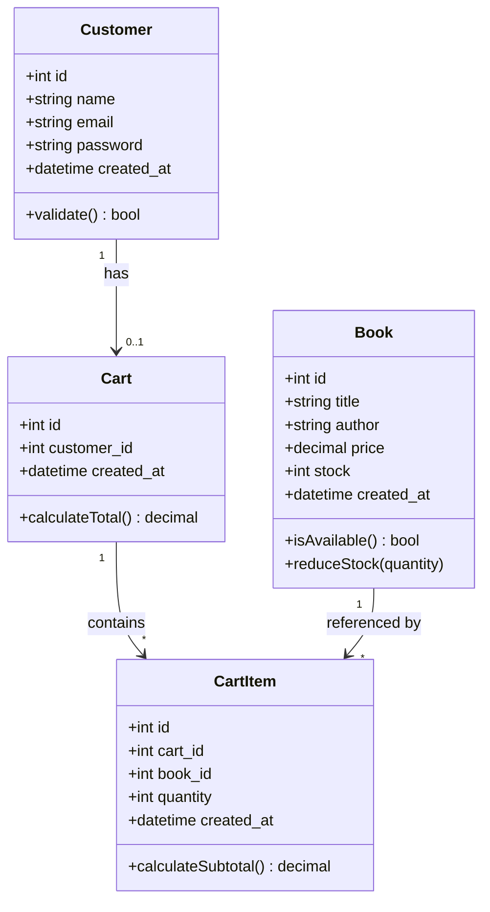
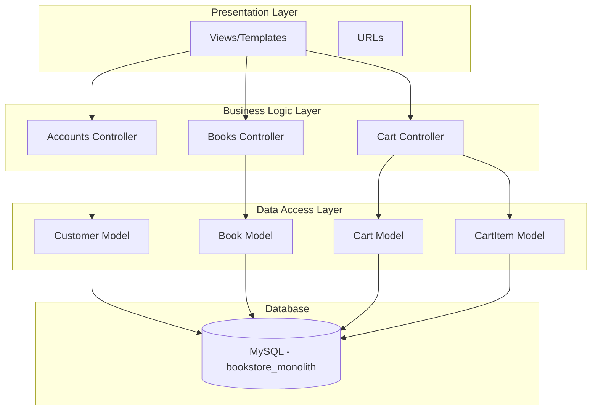
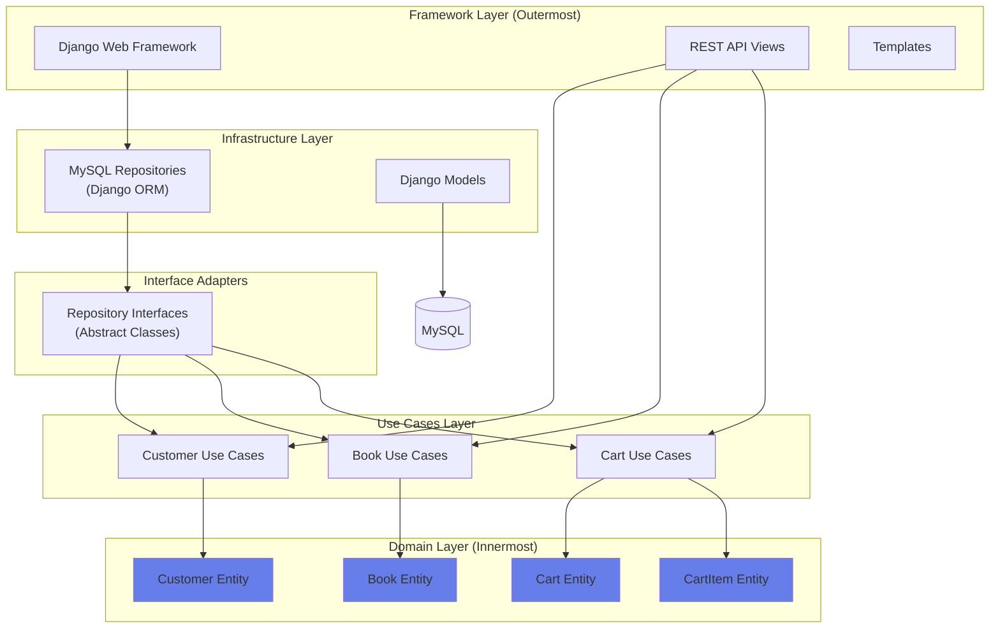
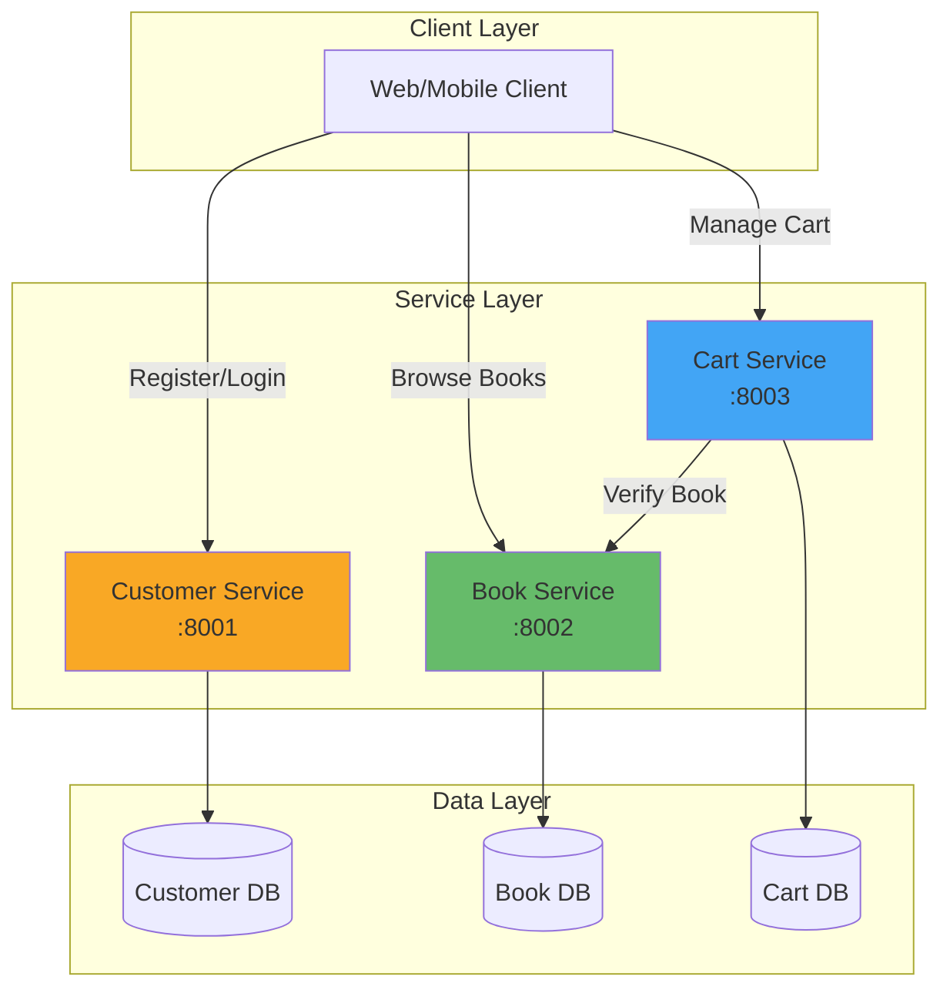

# Book Store Web System - UML Diagrams

## 1. Class Diagram

## 2. Monolithic MVC Layer Diagram

## 3. Clean Architecture Diagram

## 4. Microservices Architecture Diagram

## Diagram Descriptions

### Class Diagram
Shows the domain entities and their relationships:
- **Customer** has one **Cart**
- **Cart** contains multiple **CartItem**s
- Each **CartItem** references a **Book**

### MVC Layer Diagram (Monolithic)
Three-tier architecture:
- **Presentation**: Views and URL routing
- **Business Logic**: Controllers handling business rules
- **Data Access**: Models interacting with single database

### Clean Architecture Diagram
Concentric circles showing dependency rule:
- **Domain** (center): Pure business entities
- **Use Cases**: Application business rules
- **Interfaces**: Abstract repository contracts
- **Infrastructure**: Framework-specific implementations
- **Framework** (outer): Django web framework

Dependencies point inward only!

### Microservices Architecture Diagram
Distributed system with three independent services:
- Each service has its own database (database per service pattern)
- Services communicate via REST APIs
- Cart service depends on Book service for validation
- Horizontal scalability and fault isolation

## Visual Paradigm Import

To import these diagrams into Visual Paradigm:
1. Open Visual Paradigm
2. Create New Project
3. Use "Reverse Engineering" → "Mermaid" to import above diagrams
4. Or manually recreate using the structure shown above

## Export Formats
These diagrams can be exported as:
- PNG images
- PDF documents
- SVG vectors
